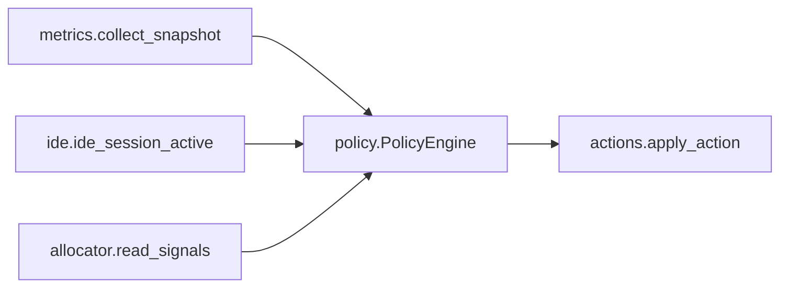

# GPUForge — technical architecture

Single-process Linux daemon. No runtime sub-agents, no bundled third-party AI stacks.

## Control loop

## Policy order

1. `ide_session_lean_cpu` — IDE host open → demote indexer/build.
2. `gpu_operational_protect_compute` — GPU busy or local GPU LLM → protect inference, shed IDE background CPU.
3. `llm_active_demote_indexer_build` — explicit local GPU LLM process.
4. `cpu_ram_pressure_secondary` — high RAM or CPU → demote extensions / remote clients.

See `docs/DESIGN.md` for product scope.
